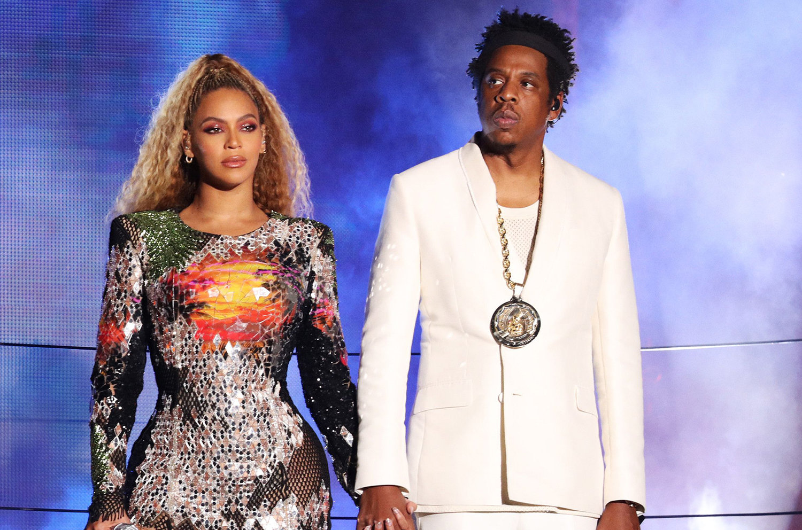
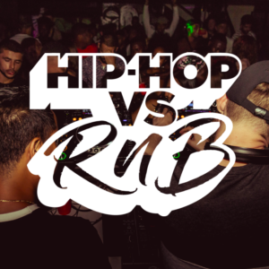

# Applied Data Science @ Columbia
# Spring 2020
# Project 1: Hip-Hop vs. R&B: Things You Don't Know



### [Project Description](doc/)

Term: Spring 2020

+ Projec title: Hip-Hop vs. R&B: Things You Don't Know
+ This project is conducted by Jiancong Shen

+ Project summary: I did some explortary data analysis on Hip-Hop and R&B lyrics by applying some text mining techniques and visualizing the results in the report. Main goal of this project is to discriminate Hip-Hop music from R&B music from a lyrical perspective. The outcome shows that Hip-Hop has more lyrics in one song, focuses on girls,money and gangster and expresses more anger. 



### [Project Report](https://github.com/TZstatsADS/Spring2020-Project1-jackshen1998/blob/master/doc/Project-1-Report.html)


Following [suggestions](http://nicercode.github.io/blog/2013-04-05-projects/) by [RICH FITZJOHN](http://nicercode.github.io/about/#Team) (@richfitz). This folder is orgarnized as follows.


```
proj/
├── lib/
├── data/
├── doc/
├── figs/
└── output/
```

Please see each subfolder for a README file.
